<h1 align="center">Vansh Tomar</h1>

  <b>CSE Undergrad · Exploring AI, ML & Software Engineering</b>

  Still figuring out which one sticks — so I build in all of them.

  
  

---

## // About

- 🎓 B.Tech CSE @ **MAIT**, Delhi (2023–2027)
- 🔬 Currently deep in **applied ML** — gradient boosting, time-series, explainability (SHAP)
- 🛠️ Full-stack with the **MERN stack**, plus Python services behind FastAPI and Docker
- 💻 Comfortable across **Python, Java, JavaScript/TypeScript, C++**
- 🧪 I care about honest evaluation — held-out seasons over random splits, tests over vibes

 

## // Tech Stack

**Languages** &nbsp;      

**Frontend** &nbsp;     

**Backend & Data** &nbsp;     

**ML / AI** &nbsp;      

**Tools** &nbsp;    

 

## // Featured Projects

- ⚽ **[Transfer Value Predictor](https://github.com/Vanshcloud/Transfer-Value-Predictor)** — Market-value prediction for professional footballers with a SHAP explanation behind every number. Evaluated on held-out seasons, not a random split. · `LightGBM` `FastAPI` `Next.js`

- 🏭 **[Predictive Maintenance + GenAI](https://github.com/Vanshcloud/Predictive-Maintenance-GenAI)** — Predicts equipment failure 24 hours ahead from sensor telemetry, then explains it in plain English. Dockerised, 246 tests, 86% coverage. · `TensorFlow LSTM` `LangChain` `Streamlit`

 

<!--START_SECTION:commit-times-->
<table align="center"><tr><td><b>I'm a Night 🦉</b><pre>
1  🌞 Morning       1 commits   ░░░░░░░░░░░░░░░░░░░░░░░░░     0.5%
2  🌆 Daytime      85 commits   ███████████░░░░░░░░░░░░░░    45.2%
3  🌃 Evening      68 commits   █████████░░░░░░░░░░░░░░░░    36.2%
4  🌙 Night        34 commits   █████░░░░░░░░░░░░░░░░░░░░    18.1%
</pre></td></tr></table>
<!--END_SECTION:commit-times-->

  

 

  

 

## // GitHub Stats

  

  

